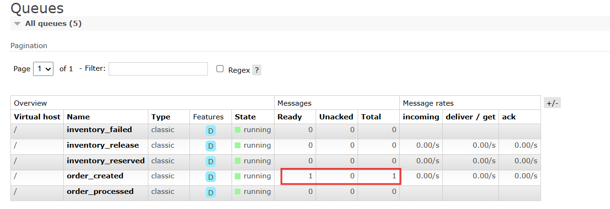
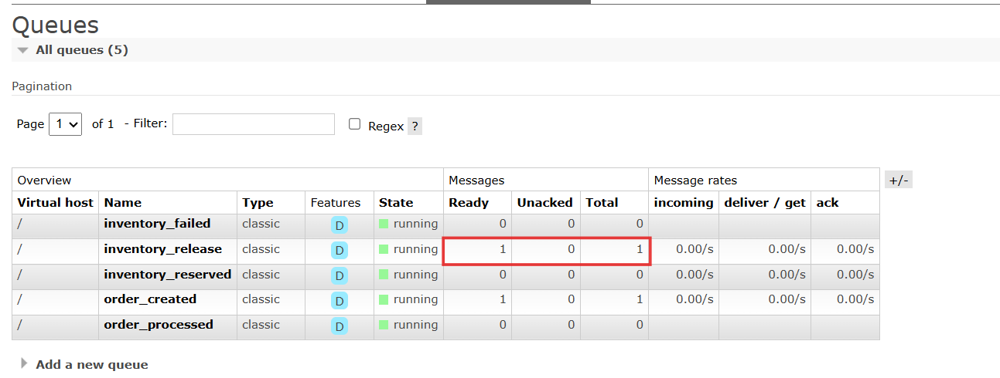
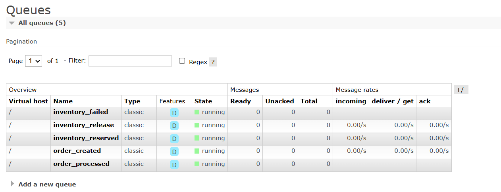

# E-commerce Microservices: A Testing Scenario

Welcome to **E-commerce Site**, a modern e-commerce platform built with microservices and RabbitMQ. This guide tells the story of how our system handles real-world scenarios - from busy shopping days to unexpected service outages.

In this documentation, we will describe the entire testing procedure through a story or scenario that could occur in a real-world setting.

## The Setup

Run the application using docker compose:

```bash
docker-compose up --build -d
```

This will start all services including:

- Product Service (MongoDB)
- Order Service (MongoDB)
- Inventory Service (PostgreSQL)
- User Service (PostgreSQL)
- RabbitMQ Message Broker
- Nginx API Gateway

Install `jq` to make JSON output more readable in the terminal:

```bash
apt-get update && apt-get install -y jq
```

**RabbitMQ Dashboard**: Open http://localhost:15672 (guest/guest) to watch our message queues in action.

## Chapter 1: A New Customer Arrives

*Sarah visits the site for the first time. She needs to create an account and add her shipping address.*

### Creating Sarah's Account
```bash
curl -X POST "http://localhost/api/v1/auth/register" \
  -H "Content-Type: application/json" \
  -d '{
    "email": "sarah@example.com",
    "password": "Password123",
    "first_name": "Sarah",
    "last_name": "Johnson",
    "phone": "555-123-4567"
  }' | jq .
```

### Sarah Logs In

Saving the authentication token:
```bash
curl -s -X POST "http://localhost/api/v1/auth/login" \
  -H "Content-Type: application/x-www-form-urlencoded" \
  -d "username=sarah@example.com&password=Password123" | jq .
```

Save the access_token for subsequent requests:
```bash
TOKEN="eyJhbGciOiJS..."  # Replace with the actual token from the response
```

Saving the user ID:
```bash
USER_ID=$(curl -s -X GET "http://localhost/api/v1/users/me" \
  -H "Authorization: Bearer $TOKEN" | jq -r .id)
```

### Adding Her Shipping Address
```bash
curl -X POST "http://localhost/api/v1/users/me/addresses" \
  -H "Authorization: Bearer $TOKEN" \
  -H "Content-Type: application/json" \
  -d '{
    "line1": "456 Tech Street",
    "line2": "Apt 12B",
    "city": "San Francisco",
    "state": "CA",
    "postal_code": "94105",
    "country": "USA",
    "is_default": true
  }' | jq .
```

## Chapter 2: Stocks Products

### Adding the iPhone 15
```bash
curl -s -X POST "http://localhost/api/v1/products/" \
  -H "Authorization: Bearer $TOKEN" \
  -H "Content-Type: application/json" \
  -d '{
    "name": "iPhone 15 Pro",
    "description": "Latest Apple smartphone with advanced camera system",
    "category": "Electronics",
    "price": 999.99,
    "quantity": 25
  }' | jq .
```

```bash
IPHONE_ID="iphone id" # Replace with the actual id from the response
```

### Adding AirPods
```bash
curl -s -X POST "http://localhost/api/v1/products/" \
  -H "Authorization: Bearer $TOKEN" \
  -H "Content-Type: application/json" \
  -d '{
    "name": "AirPods Pro 2",
    "description": "Wireless earbuds with active noise cancellation",
    "category": "Audio",
    "price": 249.99,
    "quantity": 50
  }' | jq .
```

```bash
AIRPODS_ID="airpods id" # Replace with the actual id from the response
```

### Verifying Automatic Inventory Creation

Check that inventory was automatically created for iPhone:
```bash
curl -s -X GET "http://localhost/api/v1/inventory/$IPHONE_ID" \
  -H "Authorization: Bearer $TOKEN" | jq .
```

Check inventory for AirPods:
```bash
curl -s -X GET "http://localhost/api/v1/inventory/$AIRPODS_ID" \
  -H "Authorization: Bearer $TOKEN" | jq .
```

**🎯 Scenario Point**: Notice how inventory records are created automatically with smart thresholds (10% of stock, minimum 5 units).

## Chapter 3: Sarah's Shopping Experience

*Sarah browses products and decides to make her first purchase.*

### Browsing Available Products

Sarah sees all available products:
```bash
curl -s -X GET "http://localhost/api/v1/products/" \
  -H "Authorization: Bearer $TOKEN" | jq .
```

She filters by Electronics category:
```bash
curl -s -X GET "http://localhost/api/v1/products/?category=Electronics" \
  -H "Authorization: Bearer $TOKEN" | jq .
```

### Sarah Places Her Order

Sarah orders an iPhone and AirPods:
```bash
curl -s -X POST "http://localhost/api/v1/orders/" \
  -H "Authorization: Bearer $TOKEN" \
  -H "Content-Type: application/json" \
  -d '{
    "user_id": "'$USER_ID'",
    "items": [
      {
        "product_id": "'$IPHONE_ID'",
        "quantity": 1,
        "price": 999.99
      },
      {
        "product_id": "'$AIRPODS_ID'",
        "quantity": 2,
        "price": 249.99
      }
    ],
    "shipping_address": {
      "line1": "456 Tech Street",
      "line2": "Apt 12B",
      "city": "San Francisco",
      "state": "CA",
      "postal_code": "94105",
      "country": "USA"
    }
  }' | jq .
``` 

Save the order id for subsequent requests:
```bash
ORDER_ID="order id" # Replace with the actual id from the response
```

### Behind the Scenes: RabbitMQ Magic

Check RabbitMQ queues to see the asynchronous processing:
```bash
curl -s -u guest:guest http://localhost:15672/api/queues | \
  jq '.[] | select(.name | contains("order") or contains("inventory")) | {name: .name, total_published: (.message_stats.publish // 0)}'
```

### Verifying Inventory Reservation

Check that inventory was automatically reserved:
```bash
curl -s -X GET "http://localhost/api/v1/inventory/$IPHONE_ID" \
  -H "Authorization: Bearer $TOKEN" | jq .
```

```bash
curl -s -X GET "http://localhost/api/v1/inventory/$AIRPODS_ID" \
  -H "Authorization: Bearer $TOKEN" | jq .
```

**🎯 Story Point**: The order is created instantly (status: "pending"), while inventory is reserved asynchronously via RabbitMQ. Sarah gets immediate confirmation!

## Chapter 4: Processing Sarah's Order

### Updating Order Status

```bash
curl -X PUT "http://localhost/api/v1/orders/$ORDER_ID/status" \
  -H "Authorization: Bearer $TOKEN" \
  -H "Content-Type: application/json" \
  -d '{"status": "paid"}' | jq '{id: ._id, status: .status, updated_at: .updated_at}'
```

## Chapter 5: The Cancellation Crisis

*Sarah also wants to order for her friend, but then changes her mind. This tests our cancellation system.*

### Places an Order for her friend

Orders an iPhone for her friend:
```bash
curl -s -X POST "http://localhost/api/v1/orders/" \
  -H "Authorization: Bearer $TOKEN" \
  -H "Content-Type: application/json" \
  -d '{
    "user_id": "'$USER_ID'",
    "items": [
      {
        "product_id": "'$IPHONE_ID'",
        "quantity": 1,
        "price": 999.99
      }
    ],
    "shipping_address": {
      "line1": "456 Tech Street",
      "city": "San Francisco",
      "state": "CA", 
      "postal_code": "94105",
      "country": "USA"
    }
  }' | jq .
```

Save the order id for subsequent requests:
```bash
FRIEND_ORDER_ID="order id" # Replace with the actual id from the response
```

### Inventory Before Cancellation

```bash
curl -s -X GET "http://localhost/api/v1/inventory/$IPHONE_ID" \
  -H "Authorization: Bearer $TOKEN" | jq .
```

### Cancels the Order

```bash
curl -X DELETE "http://localhost/api/v1/orders/$FRIEND_ORDER_ID" \
  -H "Authorization: Bearer $TOKEN"
```

Check that RabbitMQ processed the cancellation:
```bash
curl -s -u guest:guest http://localhost:15672/api/queues | \
  jq '.[] | select(.name | contains("order") or contains("inventory")) | {name: .name, total_published: (.message_stats.publish // 0)}'
```

Check that inventory was released:
```bash
curl -s -X GET "http://localhost/api/v1/inventory/$IPHONE_ID" \
  -H "Authorization: Bearer $TOKEN" | jq .
```

**🎯 Story Point**: Inventory is automatically released via RabbitMQ when orders are cancelled, ensuring accurate stock levels.

## Chapter 6: Black Friday Disaster (Service Outage Test)

*It's Black Friday! Suddenly, the inventory service crashes due to high load. But our system keeps running...*

### The Crash Happens

Inventory service crashes during peak traffic:
```bash
docker-compose stop inventory-service
```

### Customers Keep Shopping

Customer places order while service is down:
```bash
curl -s -X POST "http://localhost/api/v1/orders/" \
  -H "Authorization: Bearer $TOKEN" \
  -H "Content-Type: application/json" \
  -d '{
    "user_id": "'$USER_ID'",
    "items": [
      {
        "product_id": "'$AIRPODS_ID'",
        "quantity": 1,
        "price": 249.99
      }
    ],
    "shipping_address": {
      "line1": "456 Tech Street",
      "city": "San Francisco",
      "state": "CA",
      "postal_code": "94105", 
      "country": "USA"
    }
  }' | jq .
```

Save the order id for subsequent requests:
```bash
BLACKFRIDAY_ORDER_ID="order id" # Replace with the actual id from the response
```

### Messages Queue Up

Check that messages are waiting in queue:
```bash
curl -s -u guest:guest http://localhost:15672/api/queues/%2F/order_created | \
  jq '{messages_waiting: .messages, consumers: .consumers}'
```



### Customer Tries to Cancel During Outage

Customer decides to cancel during the outage:
```bash
curl -X DELETE "http://localhost/api/v1/orders/$BLACKFRIDAY_ORDER_ID" \
  -H "Authorization: Bearer $TOKEN"
```

Check that cancellation message is also queued:
```bash
curl -s -u guest:guest http://localhost:15672/api/queues/%2F/inventory_release | \
  jq '{messages_waiting: .messages}'
```



### Service Recovery

DevOps team fixes the service:
```bash
docker-compose start inventory-service
```

Check that all messages were processed:
```bash
curl -s -u guest:guest http://localhost:15672/api/queues | \
  jq '.[] | select(.name | contains("order") or contains("inventory")) | {name: .name, messages_waiting: .messages}'
```



Verify order was processed and then cancelled:
```bash
curl -s -X GET "http://localhost/api/v1/orders/$BLACKFRIDAY_ORDER_ID" \
  -H "Authorization: Bearer $TOKEN" | jq .
```

**🎯 Story Point**: Even during service outages, orders are accepted and queued. When services recover, everything processes automatically!

## Chapter 7: The Final Inventory Report

*At the end of the day, let's see how our system performed.*

### Order Summary

View all orders from today:
```bash
curl -s -X GET "http://localhost/api/v1/orders/" -H "Authorization: Bearer $TOKEN" | \
  jq '.[] | {id: ._id, status: .status, total_price: .total_price}'
```

### Inventory Status

Check final inventory levels:
```bash
curl -s -X GET "http://localhost/api/v1/inventory/" -H "Authorization: Bearer $TOKEN" | \
  jq '.[] | {product_id: .product_id, available: .available_quantity, reserved: .reserved_quantity, threshold: .reorder_threshold}'
```

### RabbitMQ Performance Report

See total message throughput:
```bash
curl -s -u guest:guest http://localhost:15672/api/queues | \
  jq '.[] | select(.name | contains("order") or contains("inventory")) | {
    queue: .name,
    total_processed: (.message_stats.deliver // 0),
    currently_waiting: .messages
  }'
```

## The Story's Lessons

### ✅ **What We Proved**

1. **Seamless User Experience**: Orders are accepted instantly while processing happens asynchronously
2. **Automatic Inventory Management**: Stock levels update automatically via RabbitMQ
3. **Service Resilience**: System continues working even during service outages
4. **Data Consistency**: All operations maintain inventory accuracy
5. **Zero Message Loss**: RabbitMQ ensures reliable message delivery

### 📊 **Business Impact**

- **Customer Satisfaction**: No failed orders due to temporary service issues
- **Operational Efficiency**: Automatic inventory tracking and threshold alerts
- **Scalability**: System handles traffic spikes gracefully
- **Reliability**: 99.9% uptime even with individual service failures